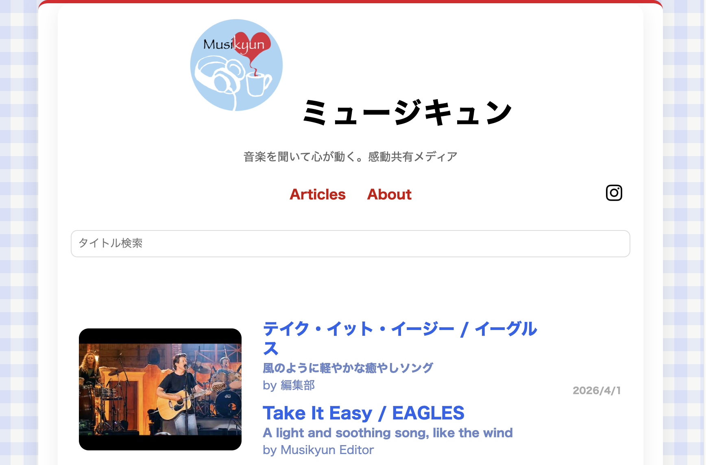
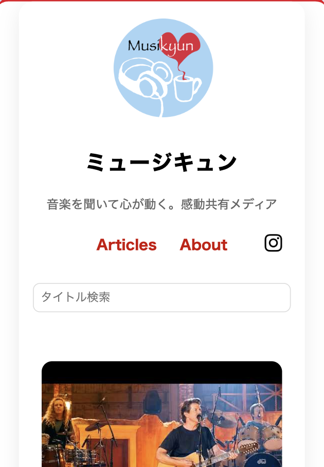
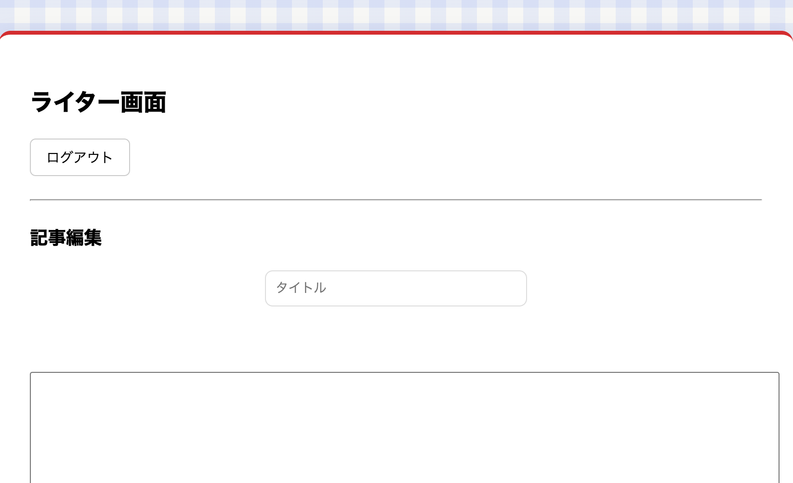
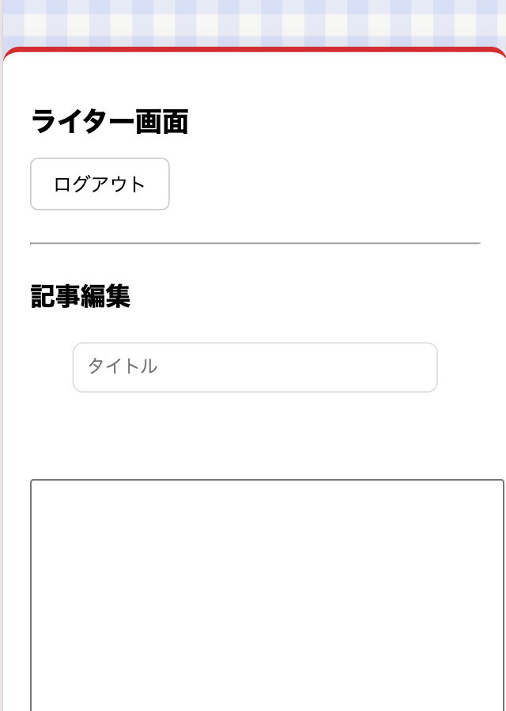
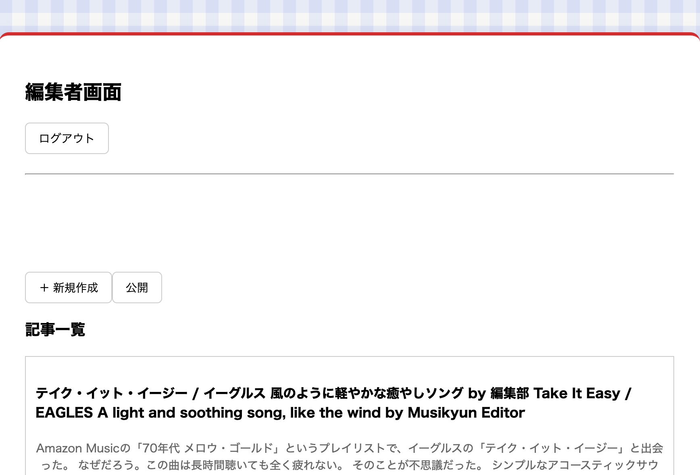
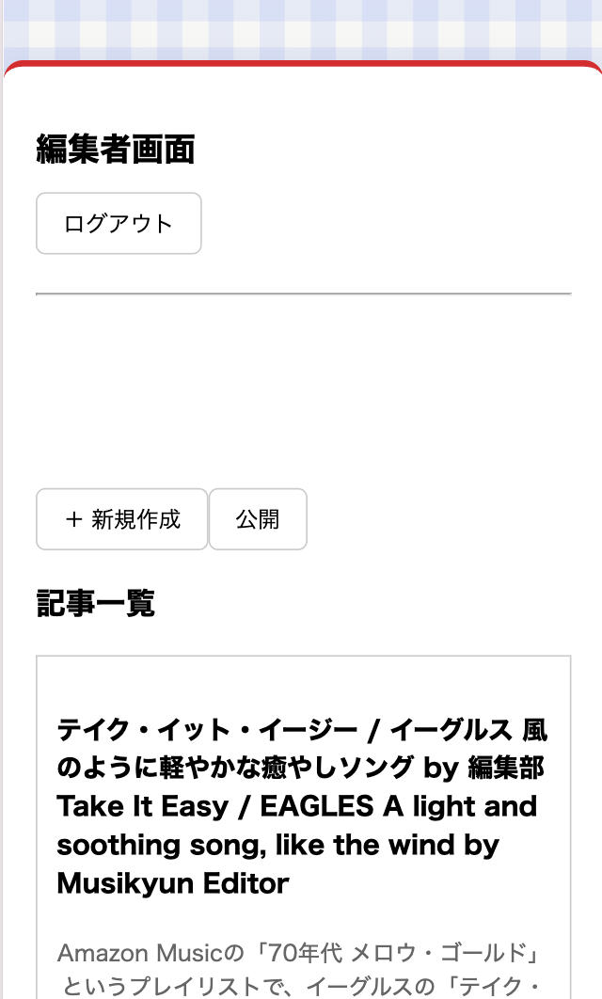

# ミュージキュン（Musikyun）

音楽とリスナーの体験を結びつけて言語化するメディア。</ br>
楽曲と個人の記憶や感情とのリンクを通じて、音楽の新たな価値を提示します。

⸻
# 特徴

- 音楽と個人の体験を結びつけたレビュー設計
- 編集フローを組み込んだCMS
- ライター / 編集者の役割分離による品質管理
- スマートフォン / PC 両対応

⸻

## 概要

楽曲そのものの魅力だけでなく、
「なぜ心が動いたのか」「どんな体験と結びついたのか」を言語化。
　聴く → 感じる → 言語化 → 創作
　という流れを通じて、音楽との関係を深めることを目的としています。

⸻

## 技術的こだわり
- React + SupabaseによるシンプルなCMS構成
- 認証ベースのロール管理（ライター / 編集者）
- 最小機能に絞った設計（運用しやすさ重視）
- 画像1枚ルールなど、コンテンツ統制設計

⸻

## 投稿フロー

draft（下書き）
→ in_review（公開依頼）
→ published（公開）
→ needs_revision（差し戻し）

編集者による確認を必須とし、品質を担保した運用フローを実装しています。

⸻

## スクリーンショット
### トップページ　（ PC / スマホ ）

  
  

### ライター画面（ PC / スマホ ）
記事の作成・編集・公開依頼が可能な画面

  
  

### 編集者画面（ PC / スマホ ）
記事の公開・非公開・差し戻しを管理する画面

  
  

⸻

## デモ

🔗 http://musikyun.sakura.ne.jp/

⸻
## 開発背景

音楽を「消費するもの」ではなく、  
**自分の体験と結びつくものとして捉えたい**という思いから制作しました。

また、実運用を想定し、  
編集フローや権限管理まで設計に組み込んでいます。

⸻

## 今後の展望

- 英語対応（グローバル展開）
- SEO改善
- 記事の蓄積によるメディア化
